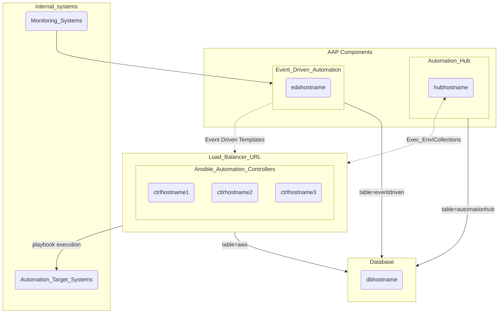

# Production AAP Installation / Upgrade

## Requirements (Per Server)

### Resource requirements
- All
  - OS RHEL 8.6 or Later
  - Python 3.8
  - DNS Resolution of each host
  - Chrony configurationed for all nodes
- Automation Controller x3
  - VM Sizing:
    - CPUs 4
    - RAM 16
    - Minimum of 40GB /var/lib/awx for execution environment storage on hyrbid nodes  
      - Projects are stored on control and hybrid nodes, and for the duration of jobs, are also stored on execution nodes. If the cluster has many large projects, consider doubling the GB in /var/lib/awx/projects, to avoid disk space errors
    - Minimum of 40GB OS
- Automation Hub
  - VM Sizing:
    - CPUs 2
    - RAM 8GB
    - Minimum of 40GB OS
    - Minimum of 60GB /var
      - pulp will reside under /var and hold the collections and execution environments
- Database
  - PostgresSQL 13
  - VM Sizing:
    - CPUs 4
    - RAM 16GB
    - Minimum of 40GB OS
    - Minimum of 250GB /var
      - 150GB per Automation Controller
      - 40GB per EDA
      - 60GB per Automation Hub
- Event Driven Automation
  - VM Sizing:
    - CPU 4
    - RAM 16GB
    - Minimum of 40GB OS
    - Minimum of 40GB /var

### Internet Access Requirements - Ensure that the following domain names are part of either the firewall or the proxy’s allowlist
  - Notes
    -  Image manifests and filesystem blobs are served directly from registry.redhat.io. However, from 1 May 2023, filesystem blobs are served from quay.io instead. To avoid problems pulling container images, you must enable outbound connections to the listed quay.io hostnames.
    This change should be made to any firewall configuration that specifically enables outbound connections to registry.redhat.io.
    Use the hostnames instead of IP addresses when configuring firewall rules.
    After making this change, you can continue to pull images from registry.redhat.io. You do not require a quay.io login, or need to interact with the quay.io registry directly in any way to continue pulling Red Hat container images.
    For more information, see the article [here](https://access.redhat.com/articles/6999582)
  - All
     - http://api.access.redhat.com:443
      - General account services, subscriptions
    - https://cert-api.access.redhat.com:443
      - Insights data upload
    - https://cert.cloud.redhat.com:443
      - Inventory upload and Cloud Connector connection
    - https://cloud.redhat.com
      - Access to Insights dashboard 
  - Automation Hub
    - https://console.redhat.com:443
      - General account services, subscriptions
    - https://catalog.redhat.com
      - Indexing execution environments
    - https://sso.redhat.com:443
      - TCP
    - https://automation-hub-prd.s3.amazonaws.com https://automation-hub-prd.s3.us-east-2.amazonaws.com/
      - Firewall access
    - https://galaxy.ansible.com
      - Ansible Community curated Ansible content
    - https://ansible-galaxy.s3.amazonaws.com
    - https://registry.redhat.io:443
      - Access to container images provided by Red Hat and partners
    - https://cert.cloud.redhat.com:443
      - Red Hat and partner curated Ansible Collections 
  - Execution Environment / Ansible Builder
    - https://registry.redhat.io:443
      - Access to container images provided by Red Hat and partners
    - cdn.quay.io:443
      - Access to container images provided by Red Hat and partners
    - cdn01.quay.io:443
      - Access to container images provided by Red Hat and partners
    - cdn02.quay.io:443
      - Access to container images provided by Red Hat and partners
    - cdn03.quay.io:443
      - Access to container images provided by Red Hat and partners 


### Licensing requirements

- Redhat Subscription attached that include Ansible dependencies
- Generally, this is labled "Ansible Automation Platform XXX"
  - ```subscription-manager list --available --all | grep "Ansible Automation Platform" -B 3 -A 6```
    - Do not use MCT4022 as a pool_id for your subscription because it can cause Ansible Automation Platform subscription attachment to fail.
- see the following url for OS level licensing
  - https://access.redhat.com/documentation/en-us/red_hat_ansible_automation_platform/2.4/html/red_hat_ansible_automation_platform_planning_guide/proc-attaching-subscriptions_planning#doc-wrapper
- The controllers will get licensed by a manifest or by signing after installation and giving credentials to redhat 

## Authentication

- SSH Key Authentication Preferred.
- Need sudo permissions


## TLS/SSL Certificate
If the customer wants to use issued certificates, We recommend using a SAN certificate to cover all the services at once that are being installed. 

Create an OpenSSL configuration file holding the customers' information using this template as a guide:
```
[ req ] 
default_bits        = 4096 
distinguished_name  = req_distinguished_name 
req_extensions      = req_ext 
prompt              = no 
[ req_distinguished_name ] 
countryName         = <2 digit country code> 
stateOrProvinceName = <state> 
localityName        = <city> 
organizationName    = <organization> 
# NOTE: Not all certificate authorities like the CN to not be a FQDN. I find 
#   it fitting to not be a FQDN because which would you pick? The spec for 
#   x509 also makes it very plain this isn't a requirement. Regardless I've 
#   encountered customers that require it to be set to something else. 
commonName          = Ansible Automation Platform 
[ req_ext ] 
subjectAltName      = @alt_names 
[ alt_names ] 
# NOTE: Add entries for each service being deployed that will also be 
#   assigned a name that is meant to specify the service and not a specific 
#   node.  This is highly recommended as it forces the customer to pre- 
#   allocate that bit of configuration, reducing the need to perform re-work 
#   later.  This is important particularly for Hub and execution environments 
#   in controller as they are linked to the FQDN of hub. 
DNS.1               = ans-controller-lb.tld 
DNS.2               = ans-eda-lb.tld 
DNS.3               = ans-hub-lb.tld  
# NOTE: Add entries of the FQDN for each server being built 
DNS.4               = controller1.tld
DNS.5               = controller2.tld
DNS.6               = controller3.tld
DNS.7               = database1.tld 
DNS.8               = eda1.tld 
DNS.9               = hub1.tld 
# NOTE: Add entries of the hostname of each server being built. I've 
#   encountered CA's that do not allow this. If so, just remove it. The 
#   result will be a certificate error if someone browses directly to 
#   the hostname. 
DNS.11              = controller1
DNS.12              = controller2
DNS.13              = controller3
DNS.14              = database1 
DNS.15              = eda1 
DNS.16              = hub1  
# NOTE: Add entries containing the IP of each server being built. I've 
#   encountered CA's that do not allow this. If so, just remove it. The 
#   result will be a certificate error if someone browses directly to 
#   the hostname. 
IP.1                = 2001:db8::11 
IP.2                = 192.0.2.11 
IP.3                = 2001:db8::12 
IP.4                = 192.0.2.12 
IP.5                = 2001:db8::13 
IP.6                = 192.0.2.13 
IP.7                = 2001:db8::14 
IP.8                = 192.0.2.14 
IP.9                = 2001:db8::15 
IP.10               = 192.0.2.15 
```
Generate the CSR with the openssl command line tool. If a new private key is required that can be generated at the same time as well with a command like: 
```
openssl req -new -nodes -newkey rsa:4096 -reqexts req_ext -keyout san.key -config tls.conf -out san.csr  
```

# Diagram


# Upgrade Process
- Pre-Work
  - Create compatible Ansible 2.9.26 Execution Environment with Collections/pip requirements


1. Standup New Rhel 8.6+ Servers for Env
2. get ansible-automation-platform-setup-<latest_version>.tar.gz
3. install AAP 1.2 3.8.5 (new) https://releases.ansible.com/ansible-tower/setup/ansible-tower-setup-3.8.5-3.tar.gz
4. Note enabled job schedules in original
5. stop all scheduled jobs in original
6. Validate Enough Space to take a backup
7. take backup of environment
   1. ```./setup.sh -e 'backup_dest=/path/to/backup_dir/' -b``
8.  enable job schedules in original (if required)
9. restore backup to (new) aap 1.2
10. validate restore
11. get new ansible-automation-platform-setup-bundle-2.4-1.2-x86_64.tar.gz
12. configure inventory for (new) and add additional components
13. run setup.sh on (new) to upgrade
14. validate upgrade
